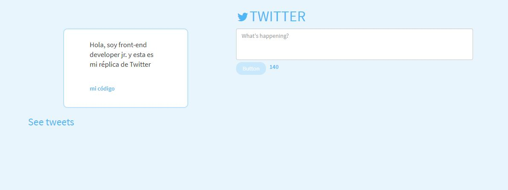
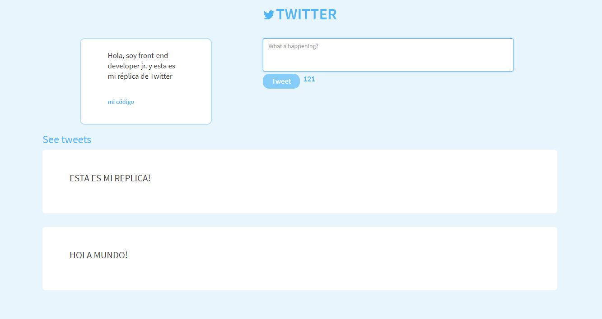

# **Réplica de Twitter**

**Actualización:**

* Conforme avanzamos en el bootcamp de Laboratoria Lima 2017-2 adquirmos más herramientas para poder poner en práctica; por lo tanto, el presente repositorio ha sido actualizado con:

  1. framework de Bootstrap 3.3

  2. librería de jquery 3.2.1

  3. por medio del grid system, este sitio es ahora responsive.

* Vistas del proyecto:

**_README original_**

* En el presente repositorio presento una réplica básica de la página web de Twitter mediante html, css y javascript.

* Este trabajo se realizó como parte de los retos de código del *bootcamp* de **Laboratoria** 2017-2.

>Imagen Guía:

 >Guía de requerimientos:

 #### **Versión 0.0.1**

* Diseñar un formulario que permita ingresar un texto y un botón para "twittear".
* Agregar un evento de click al botón o de submit al formulario.
* En el evento, obtener el texto.
* Agregar el texto al HTML.

#### **Versión 0.0.2**

* No ingresar texto vacío (deshabilitar el botón de "twittear").
* Contar la cantidad de caracteres de forma regresiva.

#### **Versión 0.0.3**

* Si pasa los 140 caracteres, deshabilitar el botón.
* Si pasa los 120 caracteres, mostrar el contador con OTRO color.
* Si pasa los 130 caracteres, mostrar el contador con OTRO color.
* Si pasa los 140 caracteres, mostrar el contador en negativo.
#### **Versión 0.0.4**

* Al presionar enter(/n) que crezca el textarea de acuerdo al tamaño del texto.